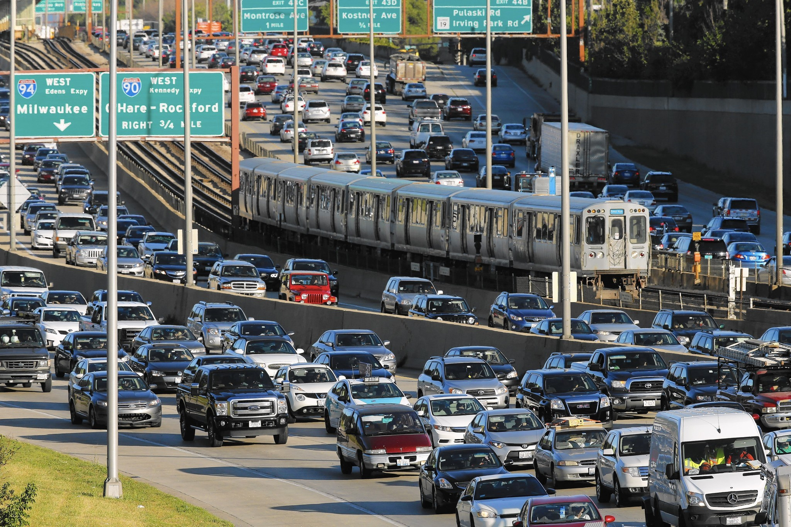
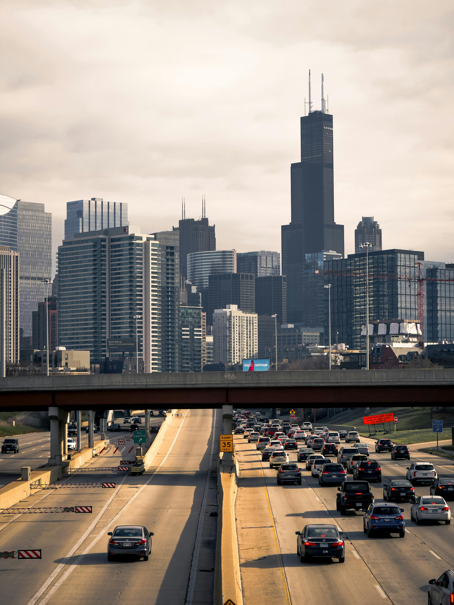
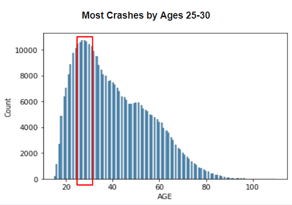
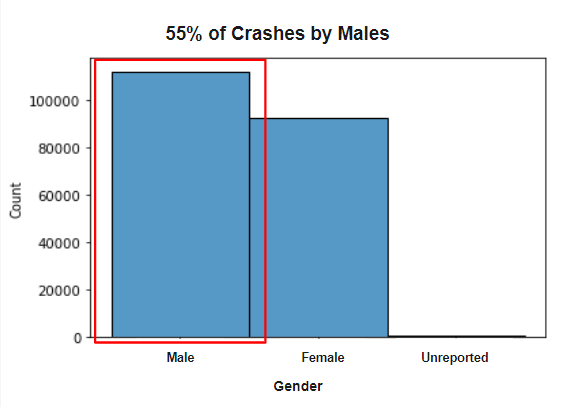
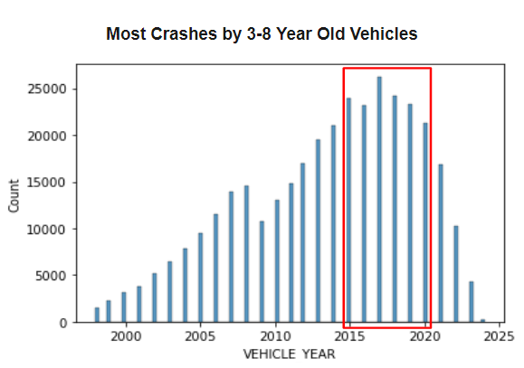
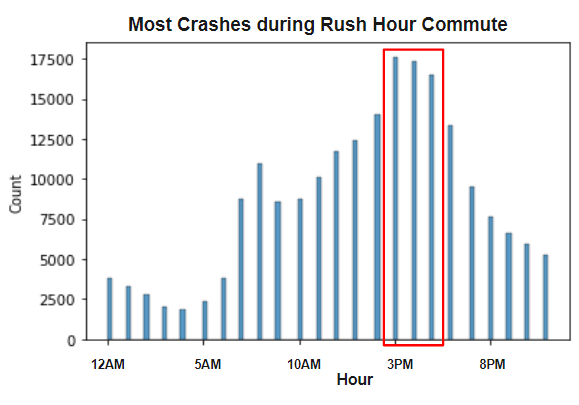
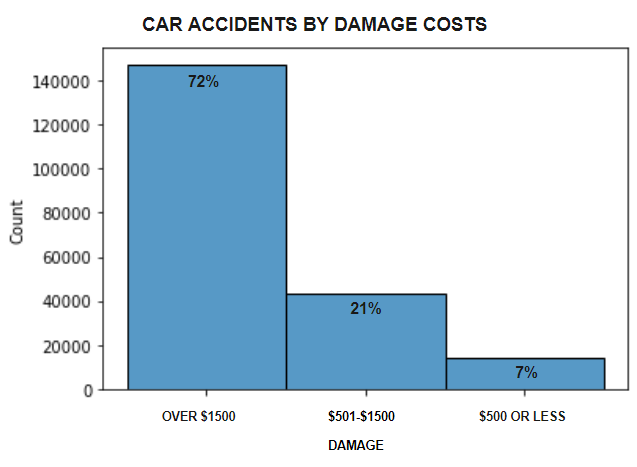
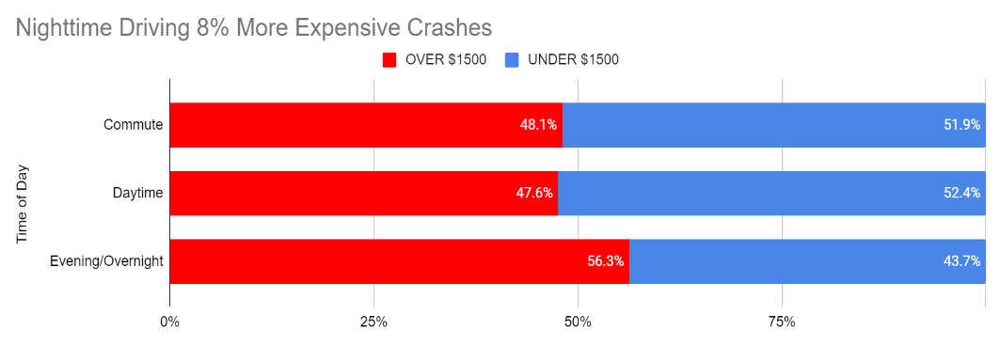

<div style="text-align: center;" style="border: 2px solid black;">
    
</div>

# Analysis of Traffic Accidents in Chicago

## Overview

We studied data on vehicle accidents in Chicago to help the company determine expected costs to repair damaged property.  Most of this data comes from the Chicago Police Department records of crashes on IL Traffic Crash Reporting form SR1050.  Some of the categories on which we mostly focused were: when crashes occurred, the ages of the vehicles involved, contributory causes of accidents, and the ages and genders of the drivers involved, as well as whether they were Illinois drivers or not.

## Business Problem

Are we able to use factors from the data that are trackable by the insurance company to determine if a private passenger vehicle crash in Chicago incurs property damage greater than $1500, and can we make good predictions using these factors?


<div style="text-align: center;" style="border: 2px solid black;">
    
</div>

## Data Understanding and Analysis

We analyzed three datasets from the Chicago Data Portal, which is provided by the City of Chicago.  They included data on vehicles involved in traffic accidents, the people involved, as well as other information about the circumstances of the crashes.  After merging the three together, we had over 766,000 records on car accidents.

We filtered the full set of observations in order to get a group of them that allowed us to model the data better.  We only looked at crashes from 2021 through November 9, 2023 that involved private passenger vehicles built in the last 25 years.  There was some missing data whose columns needed to be cleaned up as well as well.

There were some limitations to the data, however.  About half of the records came from citizens' self-reports rather than police officers at the scenes, so there could be some personal bias involved.  In addition, the damage amounts in the data are estimates of repair costs whether those came from officers or the drivers involved.  Finally, culpability for the crashes is not included, which would have allowed us to dive a bit deeper into the analysis.

Our feature engineering included combining the hours of the day and days of the week that crashes occurred to create a Time of Day distinction.  We separated drivers into those from Illinois and those from out of state to look for any trends from familiarity with Chicago driving.  Also, we created a column to identify crashes where "driving skills/knowledge/experience" played a role because not only does that show a direct fault of a driver, but it could be useful to know to assist drivers in improving their driving skill levels.

In our analysis, we investigated several variables to determine where accidents in Chicago are coming from.  First, we looked at crashes by age of driver and found tha data skewed some toward younger drivers, especially ages 25 to 30.



We also looked at crashes by gender and discovered that male drivers were more likely to be involved with 55% of accidents.



Next, we discovered that vehicles that were about 3 to 8 years old had a higher likelihood of crashing than newer cars or those over 8 years of age.



The afternoon rush hour was the time when most crashes took place overall, even if that time didn't have the highest percentage of accidents with damage over $1500.



## Modeling

We used different models to try to predict the outcome of our target variable, damage over $1500.  This variable was positive when vehicle damage from a crash was over $1500 and negative when the damage was at or below $1500.  After all data cleaning, we had about 212,000 rows of data to use for our models, and about 72% of these had damage over $1500.



We split the data for our models, putting 75% of it in the train set and 25% in the test set.  The initial model was a dummy classifier to simply predict the positive outcome.  After running that baseline, we chose to use a decision tree classifier to find the most important of the following features: vehicle year, sex, driving skills, time of day.  Unfortunately, there was no meaningful reduction in impurity when the sample was split, so the model was pretty weak, but it did show Time of Day as the most important feature, initially splitting the data on whether or not the crash occurred at night.  Next, we ran a logistic regression model with Time of Day as the only independent variable.

From these initial models, the accuracy of the decision tree and the logistic regression did not improve over the 71.7% we got for the dummy model.  Because the ratio of the dependent variable was a bit imbalanced, we deicided to run our models again with a balanced number of positives and negatives for Damage Over 1500.  To achieve this, we undersampled the majority class, the positive outcomes.

The decision tree model for the balanced data again suggested that Time of Day is the most important feature, but it still wasn't able to reduce the impurity.  We retried the logistic regression model using Time of Day as the x variable and this time the accuracy in predicting the damage level rose from 49.8% with the dummy model to 53.1%.

We continued to run other linear regression models, first adding only the Sex variable to Time of Day, then including all of our numeric variables, and finally including all of the columns in our cleaned dataset.  None of these produced accuracy levels that improved our predictive ability much.

Based on our business problem, we cannot say with a great amount of accuracy whether a crash will be above \$1500 in damage using only this data.  However, we can see that the variable that most influences that outcome is the time of day of an accident.  When we simply look at when the crash takes place and whether or not the damage is estimated to cost more than $1500, we can see that accidents in the evening and overnight are about 8% more likely to cause damage over \$1500, compared to other times of day.



## Recommendations

- **Pay attention to the time of day**

From the data included, the time of day when an accident occurs is the most important factor in determining if the amount of damage exceeds $1500.

- **Customer app for driving data**

Offer customers an app to use while driving in order to gain the hours of the day and days of the week he or she drives, as well as other potentially helpful data to study accidents further.

- **Broaden business problem to study other factors**

Looking at the variables involved in all crashes rather than focusing on how much damage occurs could help determine the likelihood of any damage at all by better predicting scenarios that lead to more accidents.

## Future Considerations

- **Compare with total drivers on the road**

Using the company's whole database of drivers to compare with crashes would allow a better understanding of not only accident information, but also data when accidents don't happen.

- **Use actual repair costs**

This data source relies on estimates of damage, which aren't reliable amounts when it comes to what repairs actually cost.  Cross-referencing real costs after repairs are done would enable more precise conclusions.

- **Expand study to other locations**

Similar analyses in other places would help the company better understand driving and accident patterns in other cities and states, as well as provide information on the subject for other types of areas, such as rural or suburban accident data.

## Appendix

The complete analysis can be found in the <a href="chicago_crash_damage_assessment.ipynb">Jupyter Notebook</a> and in our <a href="chicago_crash_damage_presentation.pdf">presentation</a>.

For technical questions, please contact John Baumgartner at <a href="mailto:jtbpilgrim@gmail.com">jtbpilgrim@gmail.com</a>.
<br>
For presentation questions, please contact Dan Rosen at <a href="mailto:dan_rosen@outlook.com">dan_rosen@outlook.com</a>.

## Repository Structure ##

You are in the README.md.  The 'chicago_crash_damage_assessment.ipynb' contains the jupyter notebook that explains our data science steps for you to replicate.  Our 'chicago_crash_damage_presentation.pdf' contains our google slides presentation that sums up important information for our audience.  In 'Data' you will be able to see the dataset we worked with.  Likewise, 'Images' will contain images used.


```bash

├── Data                                    <- Data file used in this project

├── Images                                  <- Images and Graphs used in this project obtained from external and internal sources

├── .gitignore                              <- Contains list of files to be ignored from GitHub

├── chicago_crash_damage_presentation.pdf   <- Slide Presentation of the project

├── README.md                               <- Contains README file to be reviewed

└── chicago_crash_damage_assessment.ipynb   <- Jupyter notebook of the project containing codes and analysis