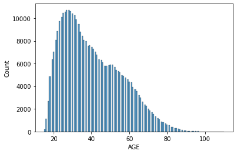

    

# Analysis of Traffic Accidents in Chicago

## Overview

We studied data on vehicle accidents in Chicago to help the company determine expected costs to repair damaged property.  Most of this data comes from the Chicago Police Department records of crashes on IL Traffic Crash Reporting form SR1050.  Some of the categories on which we mostly focused were: when crashes occurred, the ages of the vehicles involved, contributory causes of accidents, and the ages and genders of the drivers involved, as well as whether they were Illinois drivers or not.

## Business Problem

Are we able to use factors from the data that are trackable by the insurance company to determine if a private passenger vehicle crash in Chicago incurs property damage greater than $1500, and can we make good predictions using these factors?

    

## Data Understanding and Analysis

We analyzed three datasets from the Chicago Data Portal, which is provided by the City of Chicago.  They included data on vehicles involved in traffic accidents, the people involved, as well as other information about the circumstances of the crashes.  After merging the three together, we had over 766,000 records on car accidents.

We filtered the full set of observations in order to get a group of them that allowed us to model the data better.  We only looked at crashes from 2021 through November 9, 2023 that involved private passenger vehicles built in the last 25 years.  There was some missing data whose columns needed to be cleaned up as well as well.

There were some limitations to the data, however.  About half of the records came from citizens' self-reports rather than police officers at the scenes, so there could be some personal bias involved.  In addition, the damage amounts in the data are estimates of repair costs whether those came from officers or the drivers involved.  Finally, culpability for the crashes is not included, which would have allowed us to dive a bit deeper into the analysis.

Our feature engineering included combining the hours of the day and days of the week that crashes occurred to create a Time of Day distinction.  We separated drivers into those from Illinois and those from out of state to look for any trends from familiarity with Chicago driving.  Also, we created a column to identify crashes where "driving skills/knowledge/experience" played a role because not only does that show a direct fault of a driver, but it could be useful to know to assist drivers in improving their driving skill levels.

## Modeling

We used different models to try to predict the outcome of our target variable, damage over $1500.  This variable was positive when vehicle damage from a crash was over $1500 and negative when the damage was at or below $1500.  After all data cleaning, we had about 205,000 rows of data to use for our models, and about 72% of these had damage over $1500.  

We split the data for our models, putting 75% of it in the train set and 25% in the test set.  The initial model was a dummy classifier to simply predict the positive outcome.  After running that baseline, we chose to use a decision tree classifier to find the most important of the following features: vehicle year, sex, driving skills, time of day.  Unfortunately, there was no meaningful reduction in impurity when the sample was split, so the model was pretty weak, but it did show Time of Day as the most important feature.  Next, we ran a logistic regression model with Time of Day as the only independent variable.

From these initial models, the accuracy of the decision tree and the logistic regression did not improve over the 71.7% we got for the dummy model.  Because the ratio of the dependent variable was a bit imbalanced, we deicided to run our models again with a balanced number of positives and negatives for Damage Over 1500.  To achieve this, we undersampled the majority class, the positive outcomes.

